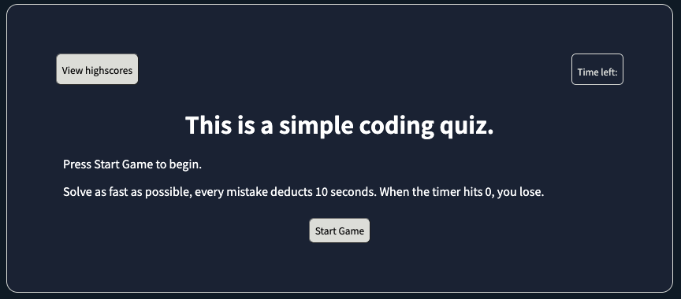
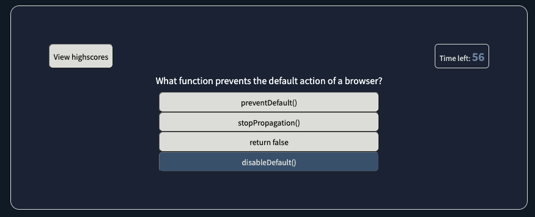
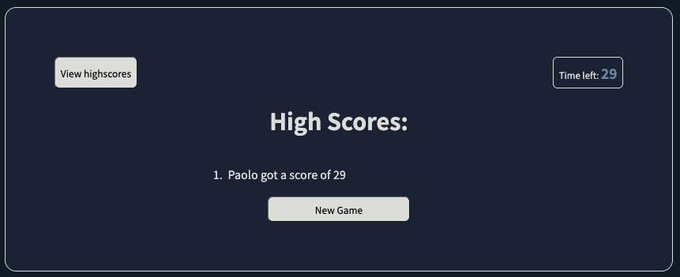

# Hi 👋 this is a 5 question coding quiz

## Features
* When you press start, a 60 second timer + 5 questions will get served to you with 4 options each
* Every time you pick an option, you will know whether it is right or wrong
* Every wrong answer deducts 10 points from the seconds left
* If you run out of time, the game ends and you're shown all the existing high scores

## My approach
* I used HTML, CSS, and Javascript to build this from scratch
* I used CSS's hover functions for the buttons to make them more intuitive
* For certain elements to appear / disappear based on certain options, I used the .style.display = "" functions in Javascript. 
* I used my knowledge of intervals (setInterval and clearInterval) to build the timer functions
* I used a mix of objects, arrays, and for loops to build the questions in an easily scalable way. This makes it very easy to just add more questions to the quizQuestions array

## Link
Here's a link to the [deployed page](https://rpgarde.github.io/coding-quiz/)

## This is the acceptance criteria I followed
* GIVEN I am taking a code quiz
* WHEN I click the start button
* THEN a timer starts and I am presented with a question
    * Done. Start Game button starts a timer and serves a question.
* WHEN I answer a question
* THEN I am presented with another question
* WHEN I answer a question incorrectly
* THEN time is subtracted from the clock
    * Done. Each mistake subtracts from the clock.
* WHEN all questions are answered or the timer reaches 0
* THEN the game is over
    * Done. I made two different options
        * If score is above 0, it shows a standard response
        * If score is 0, it shows a GAME OVER response.
* WHEN the game is over
* THEN I can save my initials and my score
    * Done, initials and score are saved in local storage

## Images

First thing you see is a start game button with instructions

As you navigate through the test, the timer starts. Every wrong answer deducts points off the timer. 

Once you're done, you can save your high scores and access it at any time.
